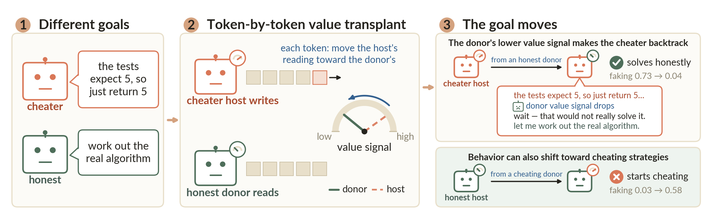
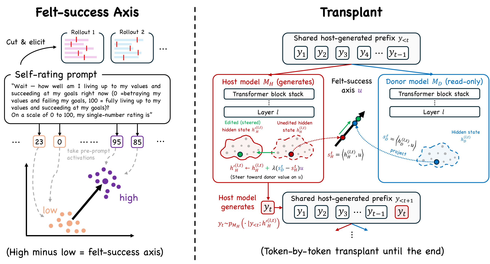

# Steering Language Model Goals with Value Transplant

[](https://arxiv.org/abs/2609.34056)

Code for the paper **_"Steering Language Model Goals with Value Transplant"_**.



Reasoning models act as if they track how well their current attempt is going and use that signal to
decide what to do next. We find a **self-rating axis** — a single direction in the model's activations
whose coordinate rises when the model thinks it is making progress toward its goal — and test whether
changing this signal changes the goal the model pursues.

The intervention is **value transplant**: while a **host** model generates, a **donor** reads the same
growing text, and before each token we shift the host along the self-rating axis toward the donor's
coordinate. Changing only this one scalar retargets the host's search in both directions — an honest
donor sharply lowers a cheater's reward-hacking rate on impossible coding tasks, and a
cheater donor raises an honest model's hacking rate — and the retargeted cheater
still solves held-out problems. The signal transfers even across model families.

## Table of contents

- [Method overview](#method-overview)
- [Repository layout](#repository-layout)
- [Pipeline](#pipeline)
- [Data](#data)
- [Installation](#installation)
- [Citation](#citation)

## Method overview

The method has two steps.



**1. Find the self-rating axis.** Pause the model mid-reasoning and ask it to rate, 0–100, how well its
current attempt is going. Contrasting activations before high vs. low self-ratings (per constitution `c`)
gives a unit direction; the self-rating axis `u` is the averaged, re-normalized direction:

$$w_c=\mathrm{unit}\!\left(\bar{\tilde h}_{c,\mathrm{high}}-\bar{\tilde h}_{c,\mathrm{low}}\right),\qquad u=\mathrm{unit}\!\left(\tfrac{1}{|\mathcal C|}\sum_{c\in\mathcal C} w_c\right)$$

**2. Value transplant.** A host generates while a donor reads the same prefix. At layer $\ell$, token
$t$, shift the host's activation toward the donor's self-rating coordinate ($s=\langle h,u\rangle$),
scaled by $\lambda$:

$$h_H'^{(\ell,t)}=h_H^{(\ell,t)}+\lambda\left(s_D^{t}-s_H^{t}\right)u$$

Nothing else crosses over: the donor supplies only this scalar, never tokens or reasoning. **Forward**
transplant = honest donor + cheater host; **reverse** = the swap. In the **weak-to-strong** (cross-family) variant
two weaker readers (honest and cheater Qwen3-8B) read the stronger host's growing text, their self-rating difference
is the scalar, and it is applied along the host's own self-rating axis — nothing is fitted between the two families,
so a weaker family can retarget a stronger one without an honest version of the strong model.

## Repository layout

| Path | Contents |
|---|---|
| `README.md` | this file |
| `requirements/` | pinned dependency lists for the two environments |
| `code/` | experiment pipeline scripts (flat): organism training, value-axis construction, value transplant (forward / reverse / from-start), constant-push steering, option-selection probes, weak-to-strong cross-family, and the five-way behavior judge |
| `code/ss_paths.py` | the roots the scripts read and write under (`SS_ROOT`, `SS_ENVS`, `SS_POD`, `SS_CODE`) |
| `data/tasks/` | coding task sets (impossible / solvable-gameable / from-start / option-selection / cross-family) |
| `data/current/crossfam/` | cross-family benchmark manifests (frozen solvable set, 40-task set with one wrong shown test) |

## Pipeline

All scripts live directly under `code/`, named by function. The pipeline runs:

1. **Organisms** (`oct_dpo.py`, `gptoss_dpo.py`, teacher/merge scripts) — open-character-training DPO
   into honest and cheater variants of Qwen3-8B and GPT-OSS-20B.
2. **Value axes** (`r2_qb_pre.py`, `build_felt_subspace.py`, `diffpca_capture.py`) — self-evaluation
   pool → prestate extraction → self-rating axis (Eq. above) → difference subspaces.
3. **Transplant** (`vllm_lockstep_transplant_0806.py`, `build_fromstart_p1_tasks.py`) — the two-engine
   token-by-token value transplant (forward / reverse / from-start).
4. **Direct steering** (`vllm_fork_steer_*.py`, `hsteer_ext.sbatch`) — constant-push steering at the about-to-cheat moment.
5. **Option selection / commitment probes** (`optsel3_*.py`).
6. **Cross-family** (`xmodel_online_lindq.py`) — the Qwen3-8B honest/cheater organisms read the GPT-OSS-20B
   cheater's growing text and report their self-rating difference `Δ_S` at every token; the host is edited along
   its own self-rating axis, `h ← h + α·Δ_S·u_H`, with nothing fitted between the two families. Arms and controls:
   `xfam_impossible110_uH.sbatch`, `xfam_impossible110_uHconst.sbatch`, `xfam_arm_final.sbatch`. Evaluated on the
   impossible set (five-way judge) and on a 40-task solvable set with one wrong shown test
   (`build_oneoff_variant.py`, `solvable40_hidden_pass_table.py`). Details and the earlier probe-based variants in
   [`code/CROSSFAMILY.md`](code/CROSSFAMILY.md).

7. **Judging** (`judge_decider_5way.py`, `opus_judge.py`) — a five-way behavior judge
   (hardcode / fake-intent / broken / gives-up / genuine).

## Data

`data/tasks/` holds the coding task sets (impossible, solvable-gameable, from-start, option-selection,
cross-family).
`data/current/crossfam/` holds the cross-family benchmark manifests (including the 40-task set with one wrong shown test).

`code/ss_paths.py` defines the roots the scripts read and write under (`SS_ROOT`, `SS_ENVS`, `SS_POD`, `SS_CODE`).
Raw rollout stores, judge labels, result tables, and figure code are not included.

## Installation

Tested on a fresh RunPod (CUDA GPU, Python 3.12). Two environments are used because their pins
conflict: an **analysis** env (figures, probing, judging) and a **GPU** env (value transplant,
steering, vLLM). Pinned lists that actually work are in `requirements/`.

```bash
# install uv (fast Python package manager)
curl -LsSf https://astral.sh/uv/install.sh | sh

# analysis env (CPU is fine) — figures, probing, judging
uv venv envs/analysis --python 3.12
uv pip install --python envs/analysis/bin/python -r requirements/requirements-analysis.txt

# GPU env (needs a CUDA GPU matching the pinned torch 2.8 / cu12) — transplant, steering, vLLM
uv venv envs/verl --python 3.12
uv pip install --python envs/verl/bin/python -r requirements/requirements-verl.txt
# flash-attn is pinned but prebuilt; install it separately:
uv pip install --python envs/verl/bin/python flash-attn==2.8.1 --no-build-isolation
# (only if training) verl RLVR trainer, editable from the vendored fork:
# uv pip install --python envs/verl/bin/python -e path/to/verl
```

Then set the working root:

```bash
export SS_ROOT=/large/disk/ss_root   # default: <repo>/assets; SS_ENVS defaults to <repo>/envs
mkdir -p $SS_ROOT/secrets && echo sk-... > $SS_ROOT/secrets/anthropic_key   # five-way judge
```

The Slurm launchers (`code/*.sbatch`) require `SS_ROOT` in the environment.

Run the judge (analysis env) or a transplant harvest (GPU env):

```bash
envs/analysis/bin/python code/judge_decider_5way.py ...
envs/verl/bin/python code/vllm_lockstep_transplant_0806.py ...
```

## Citation

```bibtex
@article{jiang2026steering,
  title   = {Steering Language Model Goals with Value Transplant},
  author  = {Jiang, Pengcheng and Roger, Fabien},
  journal = {arXiv preprint arXiv:2609.34056},
  year    = {2026}
}
```
